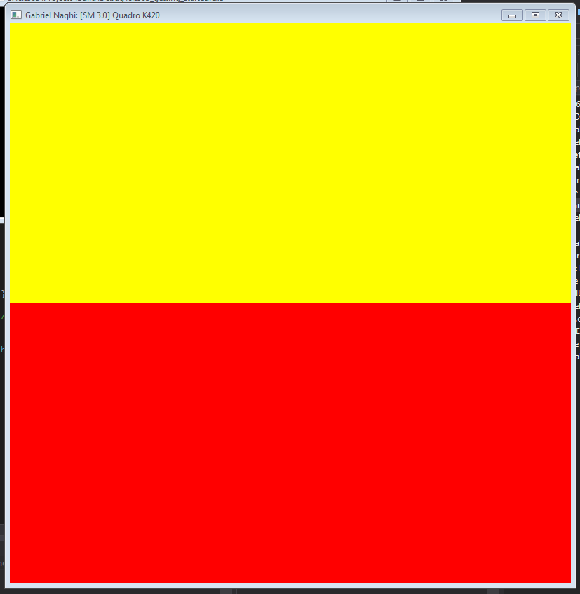
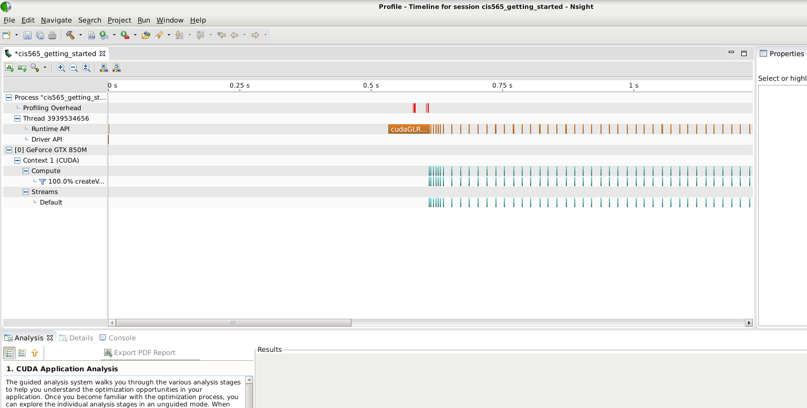

Project 0 CUDA Getting Started
====================

**University of Pennsylvania, CIS 565: GPU Programming and Architecture, Project 0**

* Gabriel Naghi
* Parts 3&4 Tested on: Windows 7 Professional SP1, i7-4790 @ 3.60GHz 16GB, Quadro K420 4096MB (Moore 100B Lab)
* Part 5 on: Debian, i7-4710HQ @ 2.50GHz 8GB, GTX 850M 2048MB (Borrowed from @krupkad)

Part 4 Screenshot

Part 5 Screenshot

